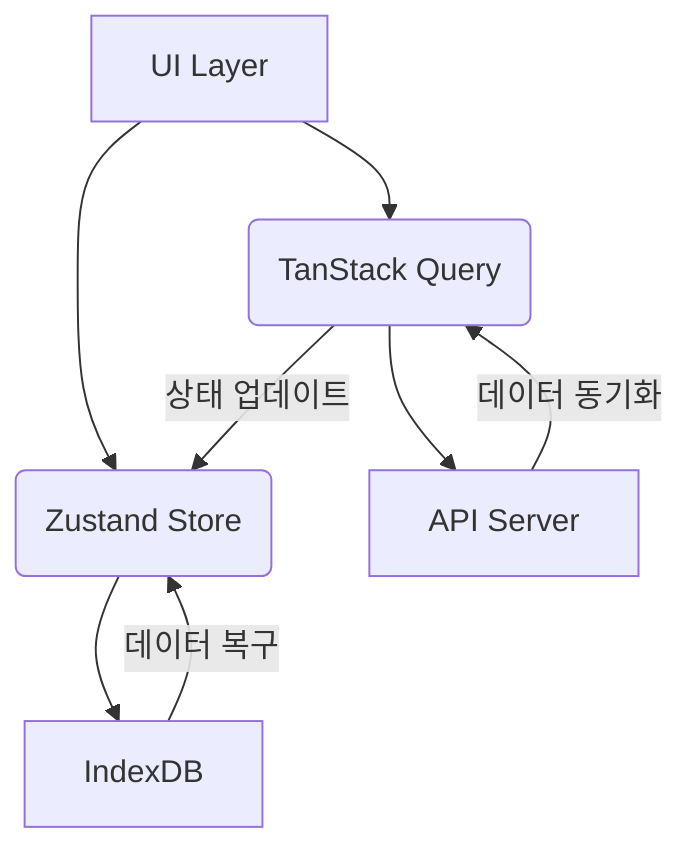
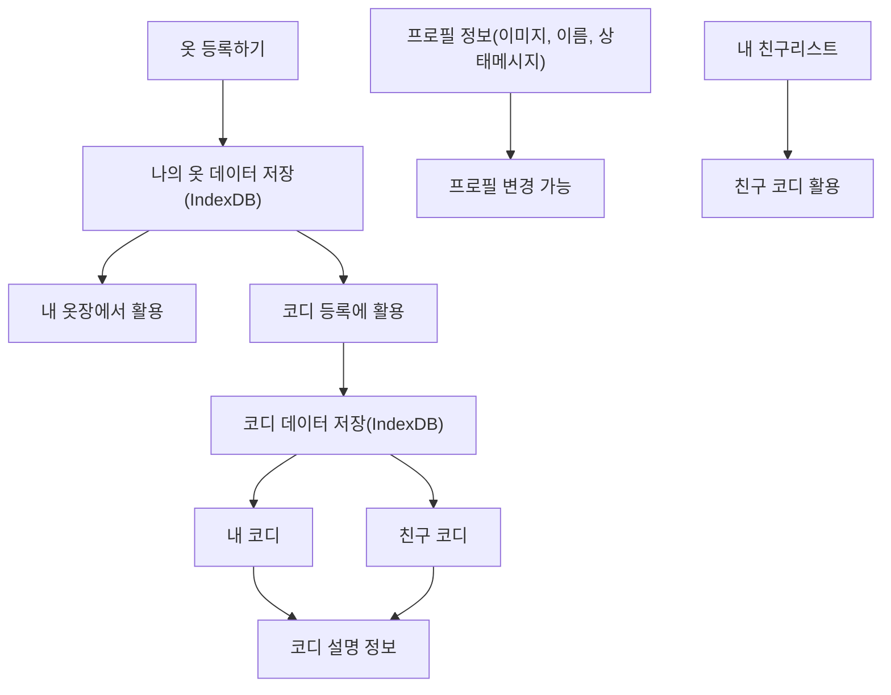

# 프로젝트 아키텍처 및 컴포넌트 설계

> 컴포넌트 설계 가이드라인:
> [디자인 시스템 문서](https://zoom-in.notion.site/1e1c4eca659c80aea3fed1fc253471a0?pvs=73)

## 1. 아키텍처 설계 원칙

### 1.1. 전체 구조

- **프론트엔드 아키텍처**: React 기반의 컴포넌트 중심 아키텍처
- **상태 관리**: Zustand + TanStack Query를 통한 상태 관리
- **데이터 지속성**: IndexDB를 통한 오프라인 데이터 저장
- **API 통신**: Axios를 활용한 RESTful API 통신
- **라우팅**: React Router를 통한 SPA 구현

### 1.2. 상태 관리 계층 구조



### 1.3. 디렉토리 구조

```
src/
├── assets/                          # [정적 리소스] 이미지/폰트/아이콘 등
│   ├── icons/                      # - 서비스 전역 SVG 아이콘
│   ├── images/                     # - 서비스 전역 이미지(로고, 기본 프로필 등)
│   └── fonts/                      # - 웹 폰트 파일
│
├── components/                      # [공통 UI 컴포넌트] (Atoms/Molecules)
│   ├── buttons/                    # - 버튼 계열 (BLUE, GREEN)
│   ├── inputs/                     # - 입력/검색 계열
│   ├── cards/                      # - 카드/아바타 계열
│   └── etc/                        # - 기타 공통 컴포넌트
│
├── containers/                      # [복합 컨테이너] (Organisms/비즈니스 조합)
│   ├── ClothListContainer/         # 옷장 그리드/리스트
│   ├── CodiEditor/                 # 코디 등록 공통 레이아웃
│   ├── ProfileHeaderCard/          # 프로필 요약 카드
│   └── UserRowItem/                # 친구 리스트 1행
│
├── features/                        # [핵심 기능 도메인] (Feature/비즈니스)
│   ├── auth/                       # 로그인/회원가입/프로필
│   ├── wardrobe/                   # 옷장/옷 등록/상세
│   ├── codi/                       # 코디 등록/추천/조회
│   └── social/                     # 친구/추천/친구 옷장
│
├── pages/                          # [페이지 진입점] (React Router)
├── api/                            # [API 계층] (TanStack Query + Axios)
├── stores/                         # [전역 상태] (Zustand + IndexDB)
├── hooks/                          # [공통 커스텀 훅]
├── types/                          # [타입 정의] (TypeScript)
└── utils/                          # [유틸리티 함수]
```

### 1.4. 주요 설계 원칙

- **단일 책임 원칙**: 각 컴포넌트는 하나의 책임만 가짐
- **재사용성**: 공통 컴포넌트는 최대한 재사용 가능하도록 설계
- **확장성**: 새로운 기능 추가가 용이하도록 모듈화
- **유지보수성**: 코드의 가독성과 일관성 유지
- **트리 쉐이킹**: Barrel 파일을 통한 명시적 export 관리
- **지속성 계층**: IndexDB ↔ Zustand 자동 동기화
- **에러 처리**: Axios 인터셉터에서 전역 토스트 통합

## 2. UI/UX 플로우 및 컴포넌트 구조

### 2.1. 메인 플로우

1. **내 옷장 관리**

   - 옷 등록하기
   - 옷장 보기/관리
   - 코디 만들기

2. **소셜 상호작용**

   - 친구 옷장 보기
   - 코디 추천하기
   - 친구 관리

3. **코디 관리**
   - 코디 등록/수정
   - 코디 공유
   - 코디 피드백

### 2.2. 데이터 흐름도



### 2.3. 핵심 UI 컴포넌트 구조

#### A. 옷 등록 플로우

```
CodiEditor (SKY BLOCK)
├── ProfileSection
│   ├── UserMiniAvatar
│   └── Badge
├── ClothMainDisplay
├── InputFields
│   ├── SearchBar
│   └── ItemCategoryBtn
└── ActionButtons
    └── PrimaryButton
```

#### B. 옷장 관리 플로우

```
ClothListContainer (GREEN BLOCK)
├── ProfileHeaderCard
│   ├── UserMiniAvatar
│   └── StatusBadge
├── FilterSection
│   ├── SearchBar
│   └── ItemCategoryBtn
└── ClothGrid
    └── ClothCard
```

#### C. 코디 추천 플로우

```
CodiEditor (SKY BLOCK)
├── CodiPreviewCard
│   ├── ClothMainDisplay
│   └── ItemList
├── UserInteraction
│   ├── UserMiniAvatar
│   └── Badge
└── ActionButtons
    └── PrimaryButton
```

## 3. 공통 컴포넌트 상세 스펙

### 3.1. 기본 UI 컴포넌트 (Atoms)

| 컴포넌트명             | 의도 및 역할 설명                                            | 주요 props                         |
| ---------------------- | ------------------------------------------------------------ | ---------------------------------- |
| `PrimaryButton (BLUE)` | 사용자의 "행동(등록/요청/완료 등)"을 유도하는 주요 액션 버튼 | `variant`, `isLoading`, `disabled` |
| `InputField (ORANGE)`  | 텍스트 기반 입력 폼 요소                                     | `placeholder`, `error`             |
| `SearchBar (GREEN)`    | 리스트 필터링을 위한 검색창                                  | `placeholder`, `value`, `onChange` |
| `Badge (PINK)`         | 상태 표시 아이콘                                             | `type`                             |
| `SwitchToggle (GREEN)` | On/Off 토글 스위치                                           | `checked`, `onToggle`              |
| `UserMiniAvatar (RED)` | 작은 사이즈 사용자 식별자                                    | `src`, `size`                      |
| `Toast`                | 즉각적인 피드백 알림                                         | `message`, `type`                  |

### 3.2. 도메인 특화 컴포넌트 (Molecules)

| 컴포넌트명               | 의도 및 역할 설명   | 주요 props             |
| ------------------------ | ------------------- | ---------------------- |
| `ClothCard (RED)`        | 옷 썸네일 카드      | `item`, `size`         |
| `ClothMainDisplay (RED)` | 옷 상세 이미지 표시 | `item`                 |
| `CodiPreviewCard (RED)`  | 코디 조합 카드      | `items`                |
| `ItemCategoryBtn (MINT)` | 카테고리 필터 버튼  | `category`, `isActive` |

### 3.3. 공통 컨테이너 (Organisms)

| 컨테이너명                         | 구성요소                         | 의도 및 역할                 |
| ---------------------------------- | -------------------------------- | ---------------------------- |
| `CodiEditor (SKY BLOCK)`           | ClothMainDisplay + 입력 컴포넌트 | 옷/코디 등록 페이지 레이아웃 |
| `ShoppingItemRow (BLUE BLOCK)`     | ClothCard + 쇼핑몰 정보          | 쇼핑몰 검색 결과 행          |
| `ClothListContainer (GREEN BLOCK)` | ClothCard Grid + 필터            | 옷장 그리드 뷰               |
| `ProfileHeaderCard (YELLOW BLOCK)` | 프로필 요약 정보                 | 사용자 정보 헤더             |
| `UserRowItem (PURPLE BLOCK)`       | 미니 프로필 + 액션               | 친구 목록 행                 |

## 4. 페이지별 컴포넌트 구성

| 페이지          | 주요 컴포넌트                                  | 컨테이너                    | 설명                       |
| --------------- | ---------------------------------------------- | --------------------------- | -------------------------- |
| **옷 등록**     | ClothMainDisplay, InputField, SearchBar, Badge | CodiEditor, ShoppingItemRow | 옷 정보 입력과 이미지 관리 |
| **내 옷장**     | ProfileHeaderCard, ClothCard, ItemCategoryBtn  | ClothListContainer          | 옷장 관리와 필터링         |
| **친구 옷장**   | ProfileHeaderCard, ClothCard, Badge            | ClothListContainer          | 친구 옷장 열람             |
| **코디 등록**   | ClothMainDisplay, InputField, ItemCategoryBtn  | CodiEditor                  | 코디 조합 생성             |
| **코디 피드백** | CodiPreviewCard, UserMiniAvatar, Badge         | -                           | 코디 추천 및 피드백        |
| **친구 관리**   | UserRowItem, SearchBar, PrimaryButton          | -                           | 친구 검색 및 관리          |

## 5. 상태 관리 및 데이터 흐름

### 5.1. Zustand 사용 포인트

- `공용 데이터`(여러 컴포넌트/페이지에서 접근):
  - 내 옷 데이터
  - 프로필 정보
  - 코디 데이터
  - 친구 리스트

### 5.2. IndexDB 사용 포인트

- 영속적으로 저장되어야 하는 데이터(옷, 코디 등)

### 5.3. 주요 데이터 및 기능

- **`옷 데이터`: 상품명 / 색상 / 옷 이미지 / 브랜드 식별자 / 카테고리 식별자 /
  색상**
  - **등록: 옷 등록하기**
  - **활용: 내 옷장, 코디 등록**
  - **공개 여부 : 공개 / 비공개**
- **`프로필 정보`: 프로필 이미지, 닉네임, 상태메세지, 계정 공개 여부, 알림 설정,
  이메일**
  - **프로필 이미지는 변경 가능**
- `코디 데이터`: 여러 옷의 조합
  - **활용: 내 코디, 친구 코디, 코디 설명 정보**
  - **x좌표 / y좌표 / z-index, 회전 / 비율 / 옷식별자 / 코디식별자**
  - **코디 설명 : 코디 설명**
  - **공개 여부 : 비공개 / 공개**
- `친구 리스트`
