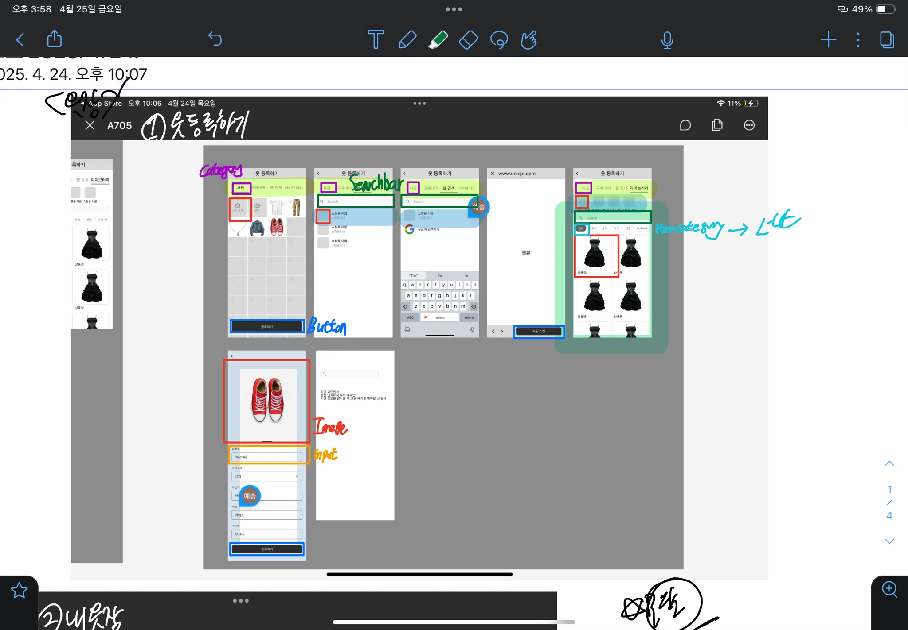
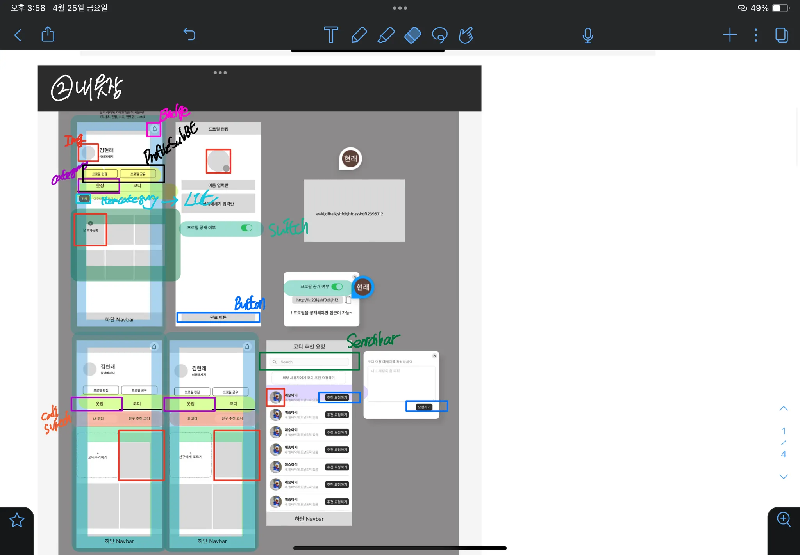
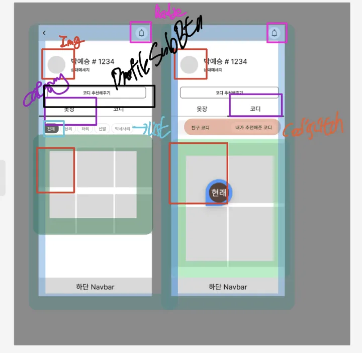
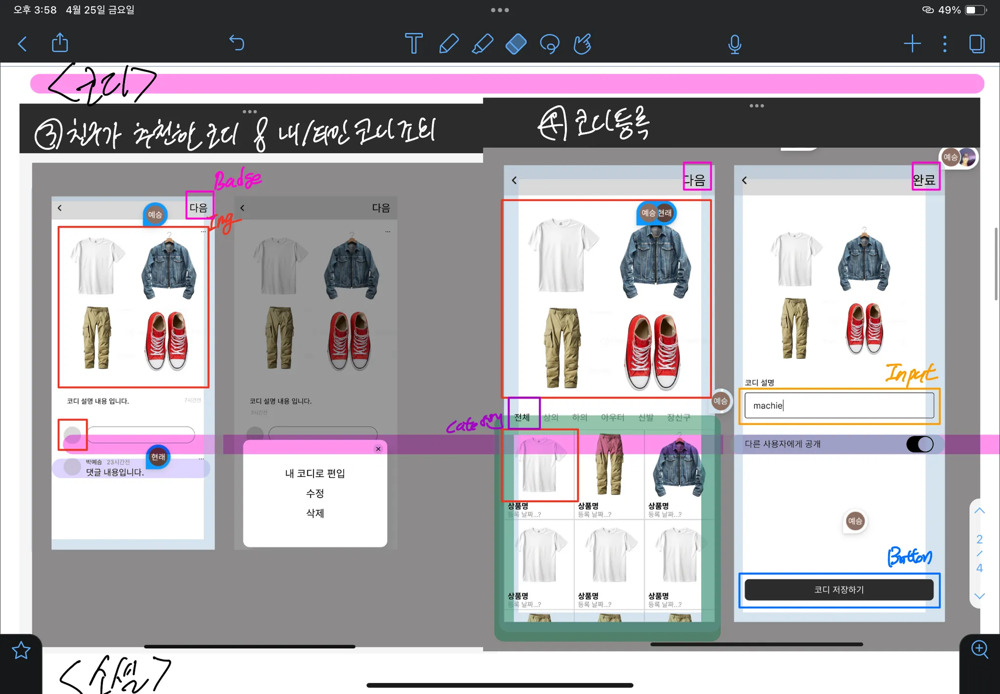
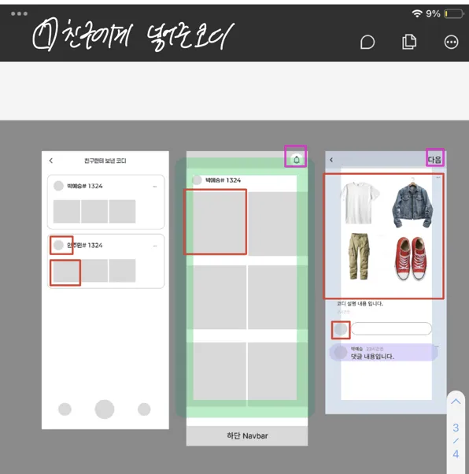
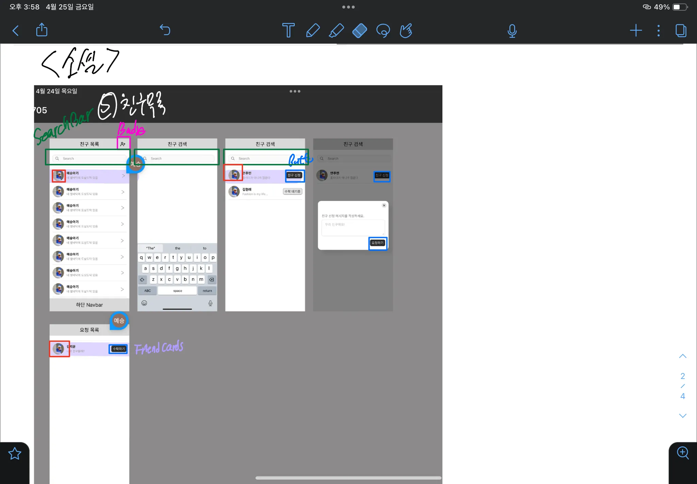
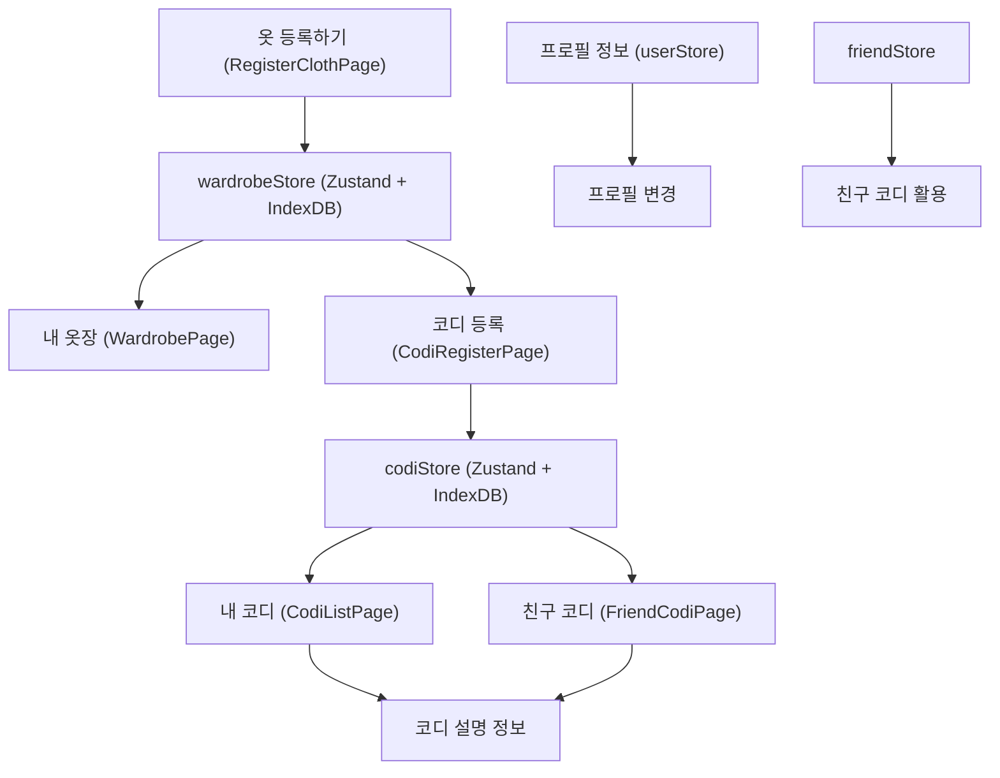

# Service Flow

# 1. 옷 등록

## 옷 등록하기

- 사진/구매내역/웹 검색/라이브러리 카테고리를 통해 각 옷 등록 영역을 선택할 수
  있음
- 사진
  - 사진 촬영 및 앨범에 접근해서 사진을 올릴 수 있음
  - 등록하기 버튼을 통해 등록
  - 상품 상세 내역 : 상품 이미지 / 상세 내역-카테고리&텍스트 ⇒ 확인하고 등록버튼
    을 통해 서버 전송
- 구매내역 스캔
  - 웹 뷰를 띄워서 react → html parsing작업을 통해서 리스트를 받아서 서버에 넘겨
    줄 수 있음
- 웹 검색
  - 검색 바를 통해서 쇼핑몰 검색을 할 수 있음
  - 특정 쇼핑몰(24cm, 무신사, 에이블리, 크림)등의 웹뷰로 넘어가는 사이트 연동 :
    전달
- 라이브러리
  - 자체적인 라이브러리를 통해서 원하는 상품을 찾을 수 있음
  - 검색 바를 통해서 상품명/브랜드명을 검색할 수 있음
  - 이에 따른 이미지 컴포넌트들

---

# 2. 옷장

## 내 옷장

- 알림을 통해서 알림 내역을 확인할 수 있음
- 프로필 / 상태메세지를 관리해서 사용자에게 나의 상태와 img를 보여줄 수 있음
  - 프로필 편집 / 공유→를 통해서 타 사용자에게 친구 신청 유도
    - 프로필 공개 여부를 선택할 수 있음, 프로필 편집에 대한 디테일한 설정 가능
    - 프로필 공개 여부에 따른 링크 생성 : 복사 후 타인에게 전달 가능
- 옷장 / 코디 카테고리를 통해 각 영역을 선택할 수 있음
  - 옷장 : 옷 추가 등록 가능
    - 아이템 카테고리 버튼을 통해서 아우터별, 상의별 모아볼 수 있게 설정
  - 코디 : 내 코디 모아보기, 친구 추천 코디 모아보기 토글 기능을 통해 각각 리스
    트를 볼 수 있음
    - 코디 추가하기 버튼을 통해 나만의 코디 커스터마이징 가능
    - 친구에게 조르기 버튼을 통해 친구에게 코디 추천 요청이 가능
      - 친구 리스트 목록을 보고 내 친구에게 코디 추천 요청을 할 수 있음 : 친구
        리스트 검색 가능
      - 또한 외부 사용자/비회원에게도 코디 추천을 요청해서 사용할 수 있음

## 친구 옷장

- 상동
- 프로필 / 상태 메세지 창에서 친구에게 바로 코디를 추천해줄 수 있음
- 친구의 옷장을 확인할 수 있음
- 친구가 오픈한 코디를 확인할 수 있으며, 친구의 코디 내가 추천해준 코디를 모아볼
  수 있음

# 3. 코디

## 코디 등록 / 친구가 추천한 코디 / 코디 조회

- 나만의 코디를 등록할 수 있음
  - 옷장에 있는 데이터들을 바탕으로 여러 이미지를 커스터마이징해서 코디 등록을
    할 수 있음
    - 코디등록은 drag&drop 방식으로 직접 사용자가 커스터마이징해서 코디 등록이
      가능
      - 좌표값이 실시간으로 바뀌고, 변경될 가능성유무가 있기에 서버와 통신 고려
    - 그게 귀찮다면, 사용자들을 위해서 템플릿을 제공
      - 특정 좌표에서만 변경이 이루어지도록 제공
  - 내가 커스터마이징한 옷에 대해서 나만의 코디 설명을 하고, 다른 사람에게 공개
    여부를 설정할 수 있음
    - 비공개처리된 코디는 다른 사람에게 보이진 않지만, 커스터마이징한 사용자 본
      인은 볼 수 있음
- 친구가 추천한 코디마다 댓글을 달아서 피드백을 남길 수 있음
  - 또한 마음에 드는 코디일 경우 내 코디로 편입이 가능

## 친구에게 넣어준 코디 → 검토 진행 중 : 소셜과 묶을 수 있음

- 각 친구별로 내가 추천해주었던 코드 리스트를 모아볼 수 있음
  - 특정 친구를 클릭하면, 그 친구에 해당되는 코디 리스트만 조회해서 볼 수 있음

---

# 4. 소셜

## 친구 목록

- 친구 목록을 통해서 친구의 상태메세지를 조회할 수 있음
  - `>` 버튼을 통해 친구 옷장으로 넘어갈 수 있음
- search 창에서 사용자 ID 검색을 통해 내 친구 목록을 검색할 수 있음
- 전체 친구 검색 리스트 창에서 특정 유저를 검색하고, 친구를 신청할 수 있음
  - 친구에게 요청을 보낼 시 친구 신청 메세지를 작성하고, 수락하기 전까지 수락 대
    기중 btn 활성화
- 내 친구 요청 목록을 볼 수 있음

---

# 5. 로그인

## 로그인 / 회원가입

- googleAuth를 통한 회원가입
- JWT
- 리프레시 토큰
- pwa 환경에서의 로그인 + 보안 주안점 고민

# 전체 서비스 데이터 흐름

